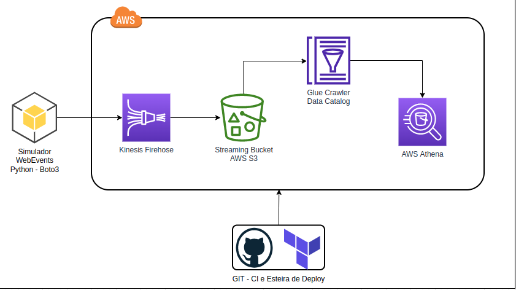

# Projeto Data Stream com o AWS Kinesis

> Projeto de Criacao de uma Arquitetura para Stream de Dados na `AWS`.

Todo o pipeline de dados sera construido utilizando o `Terraform` e executado pelas esteiras de deploy do `GitHub`.

Os dados sao enviados para o `AWS Kinesis Firehose` utilizando como source um simulador de eventos web construido da linguagem `Python` e que sobe as mensagens utilizando a sdk `boto3`.

Os dados serao destinados a um bucket na `AWS S3` que servira como storage.

O crawler da `AWS Glue` sera responsavel por criar a conexao com o storage onde estao armazenados os dados e envia-los ao `AWS Athena`.

Por fim, os dados podem ser consultados atraves de queries no `AWS Athena`.


## Arquitetura do Projeto



## Stack Tecnologica
[Python](https://www.python.org/)  
[AWS Kinesis](https://aws.amazon.com/pt/kinesis/)  
[AWS Glue](https://aws.amazon.com/pt/glue/)  
[AWS Athena](https://aws.amazon.com/pt/athena/) 
[AWS S3](https://aws.amazon.com/pt/s3/)  
[Terraform](https://www.terraform.io/)  
[Github Actions](https://github.com/features/actions)  

## Execucao do Simulador
Requisitos necessários para a instalação do sistema:
- [Python 3.10.2](https://www.python.org/downloads/)

Instale as dependências:

```terminal
    pip install -r requirements.txt
```

```terminal
    python simulations.py
```

## Criação do _Virtual Enviroment_ (opcional)
O _virtual enviroment_ Python é uma forma de encapsular as bibliotecas e recursos da sua aplicação, separando-os das demais aplicações Python no servidor e servindo na organização. A criação do ambiente virtual é opcional mas altamente recomendada.

O primeiro passo é instalar os pacotes abaixo:
> pip install virtualenv virtualenvwrapper


Para que o `virtualenvwrapper` possa ser utilizado é necessário adicioná-lo como _source_. Para isso, o comando abaixo deve ser adicionado ao fim do seu arquivo `~/.bashrc`. Salve o arquivo e reinicie o terminal.